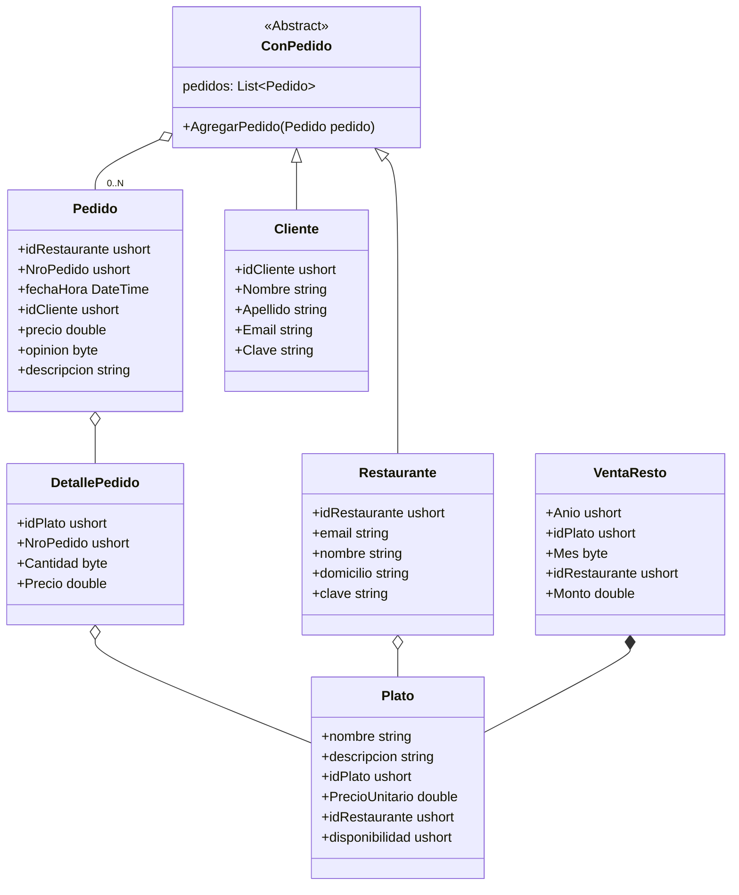

```mermaid
classDiagram

class ConPedido{
    <<Abstract>>
    pedidos: List~Pedido~
    +AgregarPedido(Pedido pedido)
}

ConPedido o-- "0..N" Pedido
ConPedido <|-- Restaurante
ConPedido <|-- Cliente

Pedido o-- DetallePedido 

DetallePedido o-- Plato 

Restaurante o-- Plato

VentaResto *-- Plato

class Pedido
Pedido: +idRestaurante ushort
Pedido: +NroPedido ushort
Pedido: +fechaHora DateTime
Pedido: +idCliente ushort
Pedido: +precio double
Pedido: +opinion byte
Pedido: +descripcion string

class Restaurante
Restaurante: +idRestaurante ushort
Restaurante: +email string
Restaurante: +nombre string
Restaurante: +domicilio string
Restaurante: +clave string

class Plato
Plato: +nombre string
Plato: +descripcion string
Plato: +idPlato ushort
Plato: +PrecioUnitario double
Plato: +idRestaurante ushort
Plato: +disponibilidad ushort

class VentaResto
VentaResto: +Anio ushort
VentaResto: +idPlato ushort
VentaResto: +Mes byte
VentaResto: +idRestaurante ushort
VentaResto: +Monto double

class DetallePedido
DetallePedido: +idPlato ushort
DetallePedido: +NroPedido ushort
DetallePedido: +Cantidad byte
DetallePedido: +Precio double

class Cliente
Cliente: +idCliente ushort
Cliente: +Nombre string
Cliente: +Apellido string
Cliente: +Email string
Cliente: +Clave string
```
